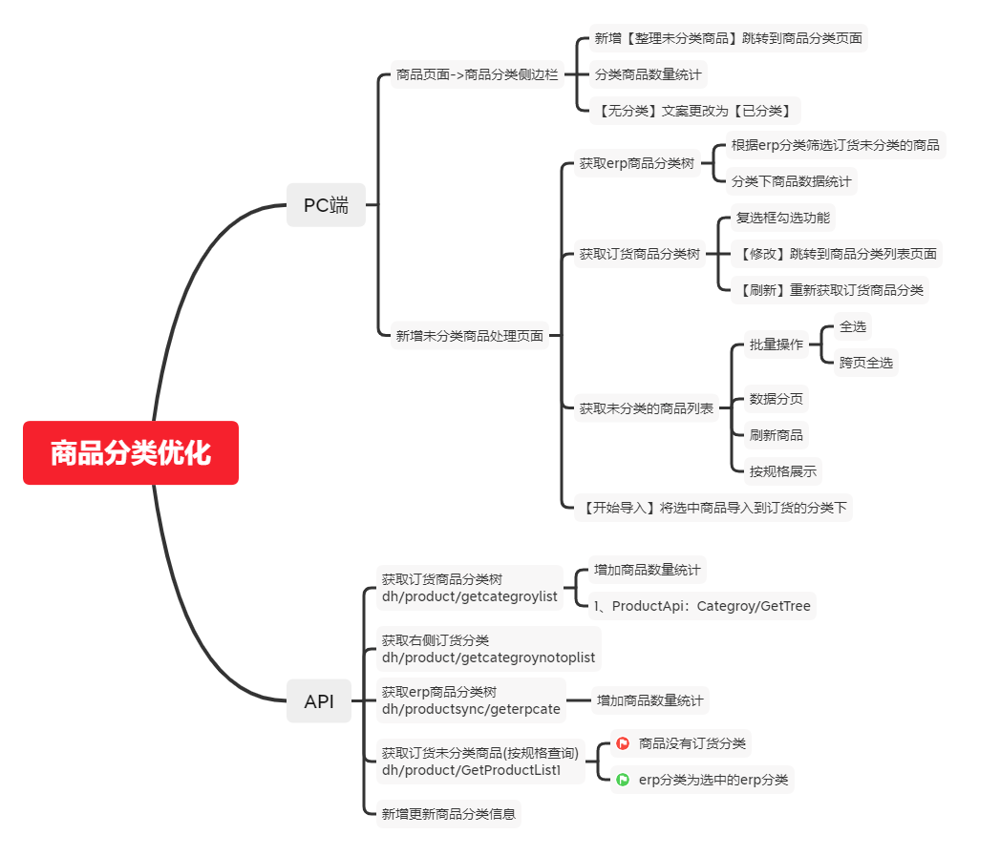
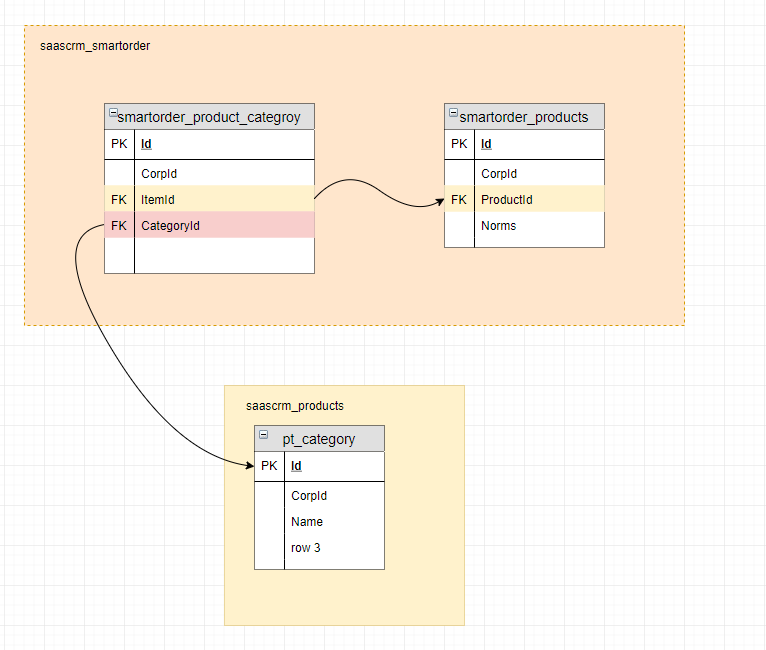
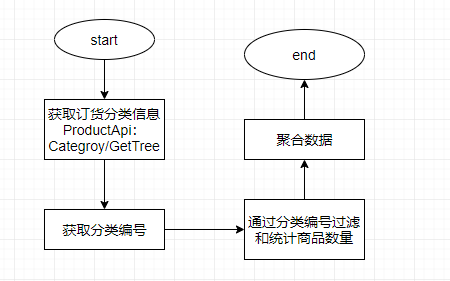
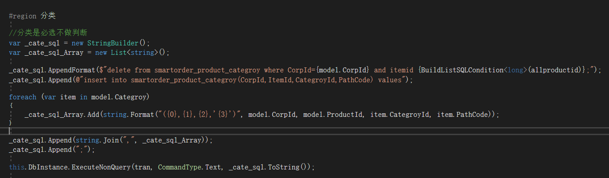

# 商品分类优化处理

## 一、需求简介
* [【ID1006231】【商品资料】未分类商品数统计及展示](https://www.tapd.cn/31380103/prong/stories/view/1131380103001006231)
* [【ID1006230】【商品资料】新增“整理未分类商品”功能](https://www.tapd.cn/31380103/prong/stories/view/1131380103001006230)

## 二、任务分解 
   
 
 |任务|描述|
 |----|---|
 |改造商品主页分类侧边栏|增加功能：【整理未分类商品】|
 |-|修改文案【无分类】为【未分类】|
 |-|修改getcategroylist接口，增加分类商品数量统计|
 |--|--|
 |新增整理未分类商品页面|展示erp分类树、并过滤未分类商品|
 |-|显示订货分类树，可多选、刷新、修改|
 |-|展示为分类商品列表，分页、全选、跨页全选、刷新|
 |-|保存商品分类信息|

## 三、技术方案
  ### 相关数据实体关系

    

 #### 1、订货分类商品数量统计
   * 逻辑流程
  
       

 #### 2、保存分类信息
   * 逻辑流程
    根据选中的商品和分类信息，先删除商品分类关系表中的相应数据，在插入选中的数据
      

 #### 3、erp分类商品数量统计
  * 有问题，需要再讨论该需求是否满足

## 四、团队协作
    需要前端同学协助处理页面样式问题

## 五、影响范围
|影响点|描述|
|------|----|
|商品主页，分类侧边栏|侧边栏样式改变|
|整理分类页面|页面样式，功能完整与正确|
|商品分类关联数据|整理分类数据或删除旧数据，新增新数据|

## 六、时间安排
|任务|开发时间|测试时间|总计|
|----|-------|-------|-------|
|商品页面侧边栏|0.5d|0.5d|1d|
|分类整理页面|0.5d|0.5d|1d|
|订货分类接口调整|0.5d|0.5d|1d|
|保存分类信息接口|0.5d|0.5d|1d|
|总计|-|-|4d|

