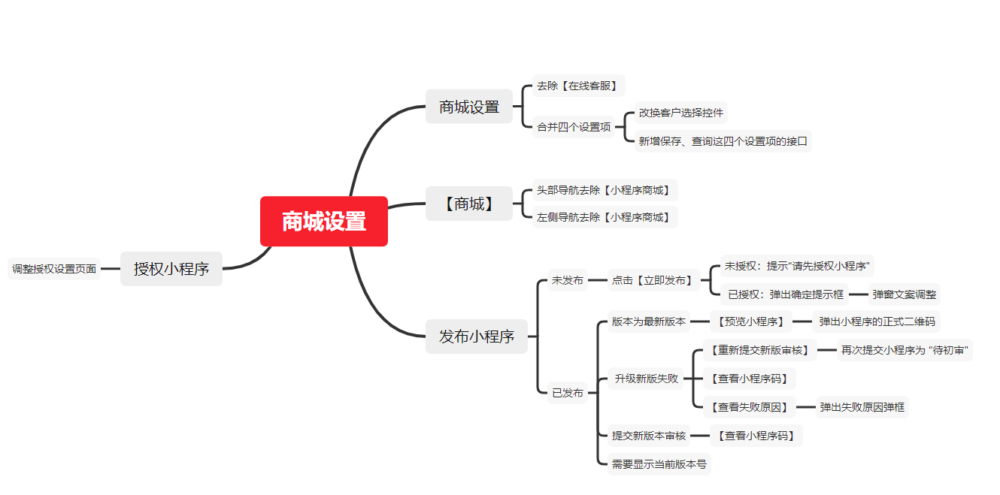

# 商城设置

## 一、需求
* 1、[【商城设置】合并“小程序商城”到“商城设置”并做交互及功能优化](https://www.tapd.cn/31380103/prong/stories/view/1131380103001006223)
* 2、[【商城设置】“发布小程序”逻辑优化](https://www.tapd.cn/31380103/prong/stories/view/1131380103001006225)
* 3、[【商城设置】“授权小程序”二级页面优化](https://www.tapd.cn/31380103/prong/stories/view/1131380103001006224)

## 二、任务分解

## 三、技术方案
1. 页面合并调整
   * 去掉小程序商城设置，导航栏和侧边栏都需要去除
   * 商城四个设置项合并，需要新增弹窗，以及保存和查询接口。

2. 小程序授权流程优化
   * 修改授权页面，链接语雀文档，需要向产品获取语雀问答地址 
  
3. 新增接口
   * 保存合并的四项设置
   * 查询合并的四项设置  

## 四、团队协作
需要前端同学编写页面并处理样式，

## 五、影响点
1. 小程序商城设置合并，部分设置项路径改变
2. 小程序授权流程改变

## 六、时间安排
|任务|开发时间|测试时间|总计|
|----|-------|-------|-------|
|授权小程序优化|0.5d|0.5d|1d|
|发布小程序逻辑优化|0.5d|0.5d|1d|
|商城设置合并处理|0.2d|0.3d|0.5d|
|保存设置接口|0.2d|0.3d|0.5d|
|总计|-|-|3d|

